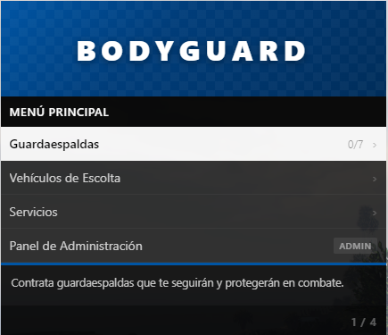
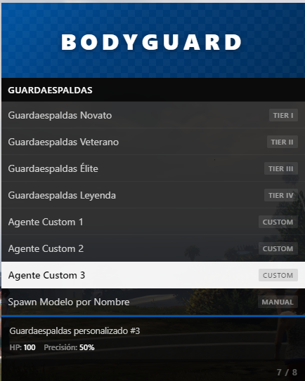
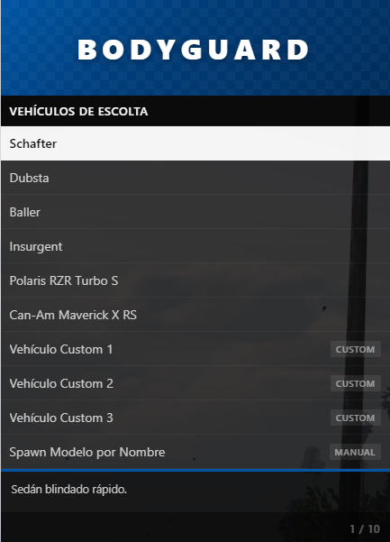
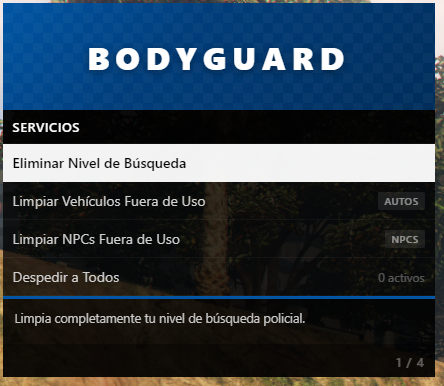
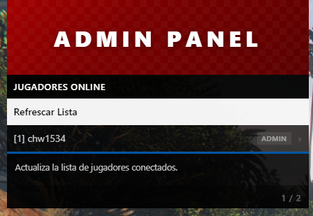
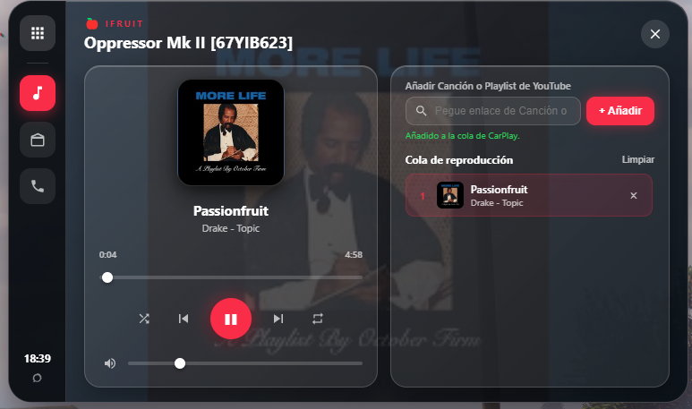
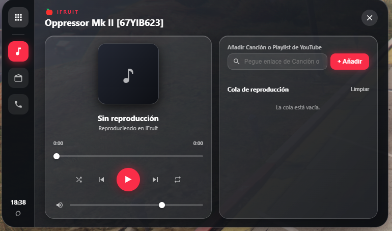
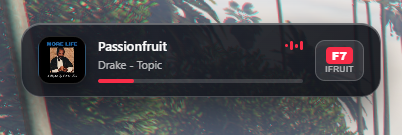

<div align="center">

<picture>
  <source media="(prefers-color-scheme: dark)" srcset="banner_white.png">
  <source media="(prefers-color-scheme: light)" srcset="banner.png">
  
</picture>

# FiveM Utilities Suite


<br/>

### 🌐 Select Language / Selecciona Idioma

[**🇺🇸 Read in English**](#-english-version) &nbsp;•&nbsp; [**🇪🇸 Leer en Español**](#-versión-en-español) &nbsp;•&nbsp; [**📄 Abrir README.es.md**](README.es.md)

---

</div>

> **Note on Browser Detection:** GitHub renders static markdown and disables client-side JavaScript for security reasons. To read in your language, click the buttons above or consult the dedicated [README.es.md](README.es.md) file. An `index.html` is also included for GitHub Pages deployments with automatic `navigator.language` browser detection.

---

<a name="-english-version"></a>
## 🇺🇸 English Version

A collection of lightweight, high-performance, and plug-and-play utilities for **FiveM** servers (Standalone, ESX, and QBCore compatible), developed and maintained by **[CHW](https://github.com/CHW1534)**.

### 📦 Included Resources

| Resource | Version | Type | Description |
| :--- | :---: | :---: | :--- |
| **[BodyGuard](#1-bodyguard)** | `2.0.0` | Standalone | AI Bodyguard hiring, armed escorts, convoy vehicles & anti-lag auto cleanup. |
| **[carplay](#2-carplay)** | `1.0.0` | Standalone | Apple CarPlay in-car NUI interface with synced 3D spatial YouTube audio & radio tuner. |
| **[esx_sticky_wheels](#3-esx_sticky_wheels)** | `6.0.0` | Standalone | OneSync State Bag parked steering wheel angle lock upon exit. |
| **[respawn_menu](#4-respawn_menu)** | `1.1.0` | Standalone / ESX | Interactive tactical respawn map, distance exclusion zones, I-Frames & admin panel. |
| **[team_selector](#5-team_selector)** | `1.0.0` | Standalone / ESX | Interactive lobby NPC team/faction selection with teleportation, blacklist & auto-loadout. |

---

### 1. 🛡️ BodyGuard (`v2.0.0`)
**Advanced AI Bodyguard & Escort Convoy System**
* **Purpose:** Allows players and VIPs to hire lethal NPC bodyguards and call armed escort vehicles for protection during gunfights, transport missions, or tactical operations.
* **Key Features:**
  * **4 Preconfigured Tiers:**
    * *Novice (Tier 1):* Pistol, 400 HP, basic defensive response.
    * *Veteran (Tier 2):* SMG + Armor, 650 HP, experienced tactical combatant.
    * *Elite (Tier 3):* Carbine Rifle + Heavy Armor, 1000 HP, high accuracy.
    * *Legend (Tier 4):* Heavy MG, 2000 HP, extreme tank defender.
  * **Custom Bodyguard Slots:** 3 customizable slots for custom ped models.
  * **Escort Vehicles:** Deploy armored vehicles (Schafter, Dubsta, Baller, Insurgent, Can-Am Maverick X RS, Polaris RZR) driven by armed NPC operatives.
  * **Anti-Lag Auto-Cleanup:** Automatically deletes abandoned vehicles (+1000m radius after 5 min) and laggy/stray bodyguards (+120m distance after 5 min) to prevent entity pool saturation.
  * **Admin Panel (`/bgadmin`):** Live in-game permission management by Discord ID, FiveM ID, License, or Steam.
  * **Minimap Blips:** Custom real-time radar blips for active bodyguards and convoys.
<p align="center">
  
  
  
</p>
<p align="center">
  
  
</p>

* **Controls & Commands:**
  * `B` (Keyboard default) or `/bodyguard` - Open recruitment menu.
  * `/dismiss` - Dismiss all hired bodyguards and escort vehicles.
  * `/bgadmin` - Access administrator permissions dashboard.

---

### 2. 🎵 carplay (`v1.0.0`)
**Modern Apple CarPlay Dashboard with Synchronized YouTube Playback**
* **Purpose:** Brings an ultra-sleek CarPlay interface into any vehicle with synchronized music and video playback for all car occupants.
* **Key Features:**
  * **3D Spatial Audio Attenuation:** Realistic exponential sound falloff up to 45 meters with vehicle proximity.
  * **Driver / Passenger Synchronization:** Everyone inside the vehicle hears the music at the exact same millisecond timestamp, synchronized via server clock delta.
  * **Drive-While-Open:** Players can accelerate, steer, and brake with the UI open. Native GTA radio wheel and scroll inputs are intercepted to prevent accidental weapon switching.
  * **GTA V Radio Monitor:** Formats real radio station labels and allows seamless toggling between GTA stations and YouTube playback without audio overlap.
<p align="center">
  
  
</p>
<p align="center">
  
</p>

* **Controls & Commands:**
  * `F7` or `/carplay` - Toggle CarPlay on/off (must be inside a vehicle).

---

### 3. 🚗 esx_sticky_wheels (`v6.0.0`)
**Persistent Parked Steering Synchronization (Sticky Wheels)**
* **Purpose:** Fixes GTA V's default behavior where wheels automatically center upon leaving a car. Leaves wheels locked at their exact turn angle when parked.
* **Key Features:**
  * **Zero Server Overhead:** Built using FiveM OneSync State Bags (`Entity(veh).state.ps_angle`), eliminating heavy server tick loops.
  * **Class Filtering:** Automatically ignores bikes, motorcycles, helicopters, planes, trains, and boats.
  * **100% Framework Agnostic:** Despite the historical `esx_` prefix, it is completely standalone and works on Standalone, ESX, QBCore, and vMenu servers.

---

### 4. 🗺️ respawn_menu (`v1.1.0`)
**Tactical Interactive Map Respawn & Spawn Protection**
* **Purpose:** Replaces default GTA death screen with a tactical satellite map where players choose deployment locations.
* **Key Features:**
  * **Dynamic Exclusion Radius (`MinRespawnDistance`):** Real-time mathematical check preventing players from spawning within a configurable distance from their death location (prevents revenge spawn-camping).
  * **Revive Here ("Revive In Place"):** Restricted by ACE permissions (`respawn.here`) or ESX job ranks (Police, EMS).
  * **I-Frames (Invulnerability Protection):** Configurable godmode timer with countdown holograms upon spawning.
  * **Cinematic Transitions:** Dynamic aerial camera interpolations and audio fade effects.
  * **Admin Panel:** Built-in UI to grant or revoke respawn permissions on the fly.

---

### 5. 👥 team_selector (`v1.0.0`)
**Tactical Team & Faction Selector Hub**
* **Purpose:** Provides a centralized, interactive lobby NPC where players select teams/factions (Police, Tactical Units, Gangs, Civilians) with automatic loadout and teleportation.
* **Key Features:**
  * **Interactive Lobby NPC:** World ped with animation, interaction distance check, and custom radar blip.
  * **Blacklist Inventory Cleaner:** Automatically strips illegal or opposing weapons and items when switching jobs/teams.
  * **Automatic Loadout & Armor:** Grants weapons, ammunition, medkits, and body armor on spawn.
  * **Instant Teleportation:** Teleports players straight to their designated headquarters or faction outpost.

---

### ⚙️ Installation

1. Clone or download this repository into your FiveM server's `resources` directory:
   ```bash
   cd resources/[local]
   git clone https://github.com/CHW1534/FiveM_Utilities.git
   ```
2. Add the resources to your `server.cfg`:
   ```cfg
   ensure BodyGuard
   ensure carplay
   ensure esx_sticky_wheels
   ensure respawn_menu
   ensure team_selector
   ```
3. Restart your server or run `refresh` and `start [resourceName]` in your server console.

---

<br/>
<br/>

<a name="-versión-en-español"></a>
## 🇪🇸 Versión en Español

Colección de utilidades ligeras, ultra optimizadas y listas para usar en servidores de **FiveM** (compatibles con Standalone, ESX y QBCore), desarrolladas y mantenidas por **[CHW](https://github.com/CHW1534)**.

### 📦 Recursos Incluidos

| Recurso | Versión | Tipo | Descripción |
| :--- | :---: | :---: | :--- |
| **[BodyGuard](#1-bodyguard-es)** | `2.0.0` | Standalone | Contratación de guardaespaldas con IA, escoltas armadas, vehículos y auto-limpieza anti-lag. |
| **[carplay](#2-carplay-es)** | `1.0.0` | Standalone | Sistema NUI estilo Apple CarPlay con YouTube sincronizado, audio 3D y sintonizador de radio. |
| **[esx_sticky_wheels](#3-esx_sticky_wheels-es)** | `6.0.0` | Standalone | Mantiene las ruedas giradas al estacionar y bajarse del vehículo con OneSync State Bags. |
| **[respawn_menu](#4-respawn_menu-es)** | `1.1.0` | Standalone / ESX | Menú de reaparición táctico con mapa satelital interactivo, zonas de exclusión, I-Frames y panel admin. |
| **[team_selector](#5-team_selector-es)** | `1.0.0` | Standalone / ESX | Selección de equipos con NPC interactivo en lobby, teletransporte, blacklist de ítems y equipamiento. |

---

<a name="1-bodyguard-es"></a>
### 1. 🛡️ BodyGuard (`v2.0.0`)
**Sistema Avanzado de Guardaespaldas con IA y Vehículos de Escolta**
* **Propósito:** Permite a los jugadores contratar NPCs con IA para que los escolten, protejan y combatan a su lado tanto a pie como en vehículos armados.
* **Características Principales:**
  * **4 Tiers Predefinidos:**
    * *Novato (Tier 1):* Pistola, 400 HP, respuesta defensiva básica.
    * *Veterano (Tier 2):* Subfusil SMG + Chaleco, 650 HP, combate táctico.
    * *Élite (Tier 3):* Rifle de Asalto + Chaleco Pesado, 1000 HP, alta puntería.
    * *Leyenda (Tier 4):* Ametralladora Pesada MG, 2000 HP, máxima resistencia.
  * **Ranuras Personalizadas:** 3 slots configurables para modelos de peds personalizados.
  * **Vehículos de Escolta:** Despliegue de vehículos blindados y todoterreno (Schafter, Dubsta, Baller, Insurgent, Can-Am Maverick X RS, Polaris RZR) con conductores armados.
  * **Auto-Limpieza Anti-Lag:** Borra automáticamente vehículos abandonados (+1000m tras 5 min) y guardaespaldas rezagados (+120m tras 5 min) para evitar saturación de la pool de entidades y caídas de FPS.
  * **Panel de Administración (`/bgadmin`):** Gestión de permisos en vivo por License, Discord, Steam o FiveM ID.
  * **Blips en el Radar:** Marcadores personalizados en el minimapa para monitorear escoltas y vehículos en tiempo real.
<p align="center">
  
  
  
</p>
<p align="center">
  
  
</p>

* **Controles y Comandos:**
  * Tecla `B` (por defecto) o `/bodyguard` - Abrir menú de contratación.
  * `/dismiss` - Despedir a todos los guardaespaldas y eliminar vehículos escolta.
  * `/bgadmin` - Abrir el panel de gestión de administradores.

---

<a name="2-carplay-es"></a>
### 2. 🎵 carplay (`v1.0.0`)
**CarPlay Moderno con Reproductor de YouTube Sincronizado**
* **Propósito:** Integra una pantalla estilo Apple CarPlay en cualquier vehículo con reproducción de música y video de YouTube sincronizada para todos los ocupantes.
* **Características Principales:**
  * **Audio Espacial 3D:** Atenuación logarítmica realista del sonido hasta 45 metros según la distancia al vehículo.
  * **Sincronización Pasajero / Conductor:** Todos los pasajeros del coche escuchan la misma canción en el mismo segundo exacto, sincronizados mediante el reloj del servidor.
  * **Conducción con Menú Abierto:** Permite acelerar, frenar y maniobrar mientras el CarPlay está en pantalla. Bloquea la rueda de armas y emisoras de GTA para evitar cambios accidentales al usar el ratón.
  * **Monitor de Radio de GTA V:** Reconoce las emisoras nativas de GTA V por su nombre real y conmuta limpiamente entre radio y YouTube.
<p align="center">
  
  
</p>
<p align="center">
  
</p>

* **Controles y Comandos:**
  * Tecla `F7` o `/carplay` - Abrir/cerrar CarPlay (debes estar dentro de un vehículo).

---

<a name="3-esx_sticky_wheels-es"></a>
### 3. 🚗 esx_sticky_wheels (`v6.0.0`)
**Ángulo de Ruedas Estacionadas Persistente (Sticky Wheels)**
* **Propósito:** Elimina la limitación de GTA V donde las ruedas de los coches vuelven al centro al bajarse. Mantiene el ángulo de giro bloqueado al estacionar.
* **Características Principales:**
  * **Cero Carga en el Servidor:** Utiliza OneSync State Bags (`Entity(veh).state.ps_angle`), evitando loops pesados de sincronización.
  * **Filtro de Clases:** Excluye motos, bicicletas, botes, helicópteros, aviones y trenes.
  * **100% Standalone:** No depende de ningún framework, compatible con Standalone, ESX, QBCore y vMenu.

---

<a name="4-respawn_menu-es"></a>
### 4. 🗺️ respawn_menu (`v1.1.0`)
**Menú Táctico de Reaparición con Mapa Satelital y Protección**
* **Propósito:** Reemplaza la pantalla de muerte clásica de GTA por un menú táctico con mapa satelital donde el jugador elige dónde desplegarse.
* **Características Principales:**
  * **Radio de Exclusión Dinámico (`MinRespawnDistance`):** Filtra en tiempo real los puntos de reaparición para no permitir aparecer cerca de donde murió el jugador (evita spawn-kill/revancha).
  * **Revivir en el Sitio ("Revive Here"):** Restringido por permisos ACE (`respawn.here`) o trabajos ESX (Policía, Médicos).
  * **I-Frames (Invulnerabilidad de Spawn):** Tiempo de protección contra daños con cuenta regresiva holográfica al reaparecer.
  * **Transición Cinematográfica:** Cámaras aéreas fluidas y transiciones suaves de sonido.
  * **Panel de Administración:** Interfaz NUI para otorgar permisos a jugadores en vivo.

---

<a name="5-team_selector-es"></a>
### 5. 👥 team_selector (`v1.0.0`)
**Lobby Táctico con Selección de Equipos por NPC**
* **Propósito:** Punto centralizado con un NPC animado para que los jugadores elijan facción o bando con equipamiento y teletransporte automático.
* **Características Principales:**
  * **NPC en el Lobby:** Ped animado con icono en el radar y detección de proximidad.
  * **Limpiador de Blacklist:** Retira automáticamente armas y objetos prohibidos o del equipo contrario al cambiar de bando.
  * **Equipamiento y Chaleco Automático:** Asigna armas, munición y botiquines al confirmar la selección.
  * **Teletransporte Inmediato:** Despliega al jugador en las coordenadas base del equipo asignado.

---

### ⚙️ Instalación en tu Servidor

1. Descarga o clona este repositorio dentro de la carpeta `resources` de tu servidor:
   ```bash
   cd resources/[local]
   git clone https://github.com/CHW1534/FiveM_Utilities.git
   ```
2. Añade las líneas correspondientes en tu `server.cfg`:
   ```cfg
   ensure BodyGuard
   ensure carplay
   ensure esx_sticky_wheels
   ensure respawn_menu
   ensure team_selector
   ```
3. Reinicia tu servidor o escribe `refresh` y `start [nombre_del_recurso]` en la consola del servidor.

---

### 👨‍💻 Autor y Contacto
* **Autor:** [CHW](https://github.com/CHW1534)
* **GitHub Repository:** [https://github.com/CHW1534/FiveM_Utilities](https://github.com/CHW1534/FiveM_Utilities)
* **Licencia:** MIT - Libre para uso y modificación en servidores de FiveM.
