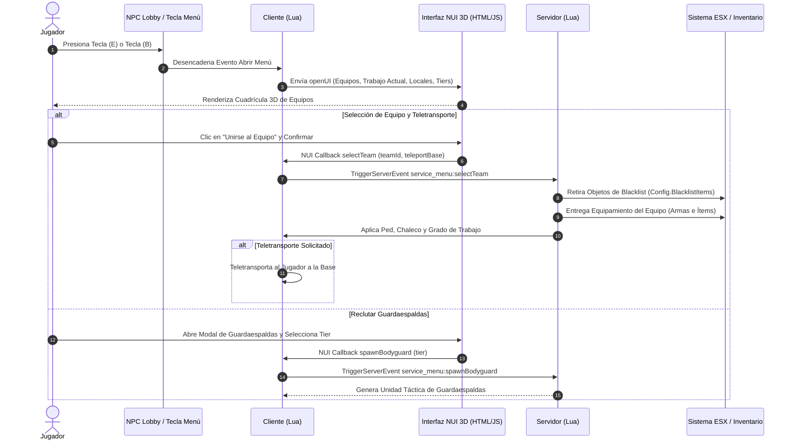

<div align="center">

# 🎖️ Menú Táctico de Servicios y Facciones (`service_menu`)


<br/>

### 🌐 Seleccionar Idioma / Select Language

[**🇪🇸 Leer en Español**](README.es.md) &nbsp;•&nbsp; [**🇺🇸 Read in English**](README.md) &nbsp;•&nbsp; [**⬅️ Volver a la Suite de Utilidades**](../README.es.md)

---

</div>

## 📌 Visión General

**`service_menu`** es un recurso avanzado y de alto rendimiento para servidores de FiveM enfocado en servidores de rol táctico, guerras de facciones y operaciones militares/policiales. Proporciona una interfaz web **3D NUI** donde los jugadores pueden seleccionar su bando o facción, consultar el equipamiento asignado, contratar guardaespaldas con IA, teletransportarse a su base operativa o regresar al estado civil.

El sistema incorpora un limpiador de inventario por **Blacklist** que retira automáticamente el armamento o ítems restringidos al cambiar de equipo o finalizar servicio, evitando duplicaciones y desbalances en la economía del servidor.

---

## 🎨 Experiencia Web NUI 3D

Diseñado bajo los estándares de desarrollo visual 3D (`/3d-web-experience`), la interfaz NUI incluye:

* **Inclinación 3D Perspectiva Interactiva:** Las tarjetas de equipo se inclinan dinámicamente en los ejes X e Y según la posición del cursor del ratón con profundidad de perspectiva (`perspective(1000px)`).
* **Profundidad Glassmorphic:** Filtros CSS backdrop blur (`blur(16px)`), destellos de luz adaptativos por color de bando y transiciones a 60 FPS.
* **Vista Táctica de Objetos:** Visualización interactiva con iconos de armas, municiones, chalecos y botiquines.
* **Modales de Confirmación:** Ventanas emergentes tácticas para seleccionar teletransporte a base y reclutamiento de guardaespaldas.

---

## 🏗️ Arquitectura y Flujo de Eventos



---

## ✨ Características Principales

1. **Centro de Selección de Equipos y Facciones:**
   * Configurable desde `config.lua` (Yomas, Pochas, Cartel, Policía, Ejército, Civil, etc.).
   * Colores representativos, insignia personalizada, coordenadas de base y modelos ped dedicados.
2. **Filtro Limpiador de Blacklist:**
   * Remueve automáticamente armas de alto calibre, municiones especiales y chalecos al cambiarse de facción o volver a Civil.
3. **Entrega Automática de Equipamiento y Blindaje:**
   * Otorga armas, cargadores, botiquines y chaleco antibalas al instante tras confirmar el bando.
4. **Teletransporte a Base Operativa:**
   * Pregunta al jugador si desea desplegarse directamente en la base de su equipo o permanecer en su ubicación actual.
5. **Integración de Escoltas y Guardaespaldas IA:**
   * Permite contratar guardaespaldas en servicio para recibir cobertura y escolta durante tiroteos.
6. **NPCs Interactivos y Blips en el Radar:**
   * Genera NPCs con animaciones de guardia, texto 3D interactivo y blips en el minimapa.
7. **Panel de Gestión de Administradores (`Config.Admins`):**
   * Control de accesos mediante licencias de FiveM, Discord ID o Steam.

---

## ⚙️ Referencia de Configuración (`config.lua`)

```lua
Config = {}

-- Configuración de Framework
Config.UseESX = true
Config.ESXExport = 'esx:getSharedObject'

-- Tecla para abrir el Menú (29 = Tecla B)
Config.MenuKey = 29

-- NPC del Lobby Principal
Config.MainNPC = {
    model = 's_m_y_swat_01',
    coords = vec4(-1038.5, -2739.8, 20.1, 330.0),
    scenario = 'WORLD_HUMAN_COP_IDLES',
    blip = {
        enabled = true,
        sprite = 487,
        color = 3,
        scale = 0.8,
        text = 'Selección de Equipos'
    }
}

-- Blacklist de Ítems: Se retiran al cambiar de equipo o volver a Civil
Config.BlacklistItems = {
    'WEAPON_CARBINERIFLE',
    'WEAPON_ASSAULTRIFLE',
    'WEAPON_COMBATPISTOL',
    'WEAPON_SMG',
    'armor',
    'medikit'
}

-- Equipos Disponibles
Config.Teams = {
    {
        id = 'yomas',
        name = 'Fuerza Táctica Yomas',
        job = 'yomas',
        description = 'Escuadrón especial de operaciones tácticas.',
        spawnCoords = vec4(1392.2, 1141.6, 114.3, 90.0),
        color = '#3b82f6',
        colorGlow = 'rgba(59, 130, 246, 0.4)',
        image = 'img/yomas.jpg',
        badge = 'FUERZA TÁCTICA',
        items = {
            { name = 'WEAPON_CARBINERIFLE', count = 1, type = 'weapon' },
            { name = 'WEAPON_COMBATPISTOL', count = 1, type = 'weapon' },
            { name = 'armor', count = 2, type = 'item' }
        }
    }
}
```

---

## 🎮 Controles y Comandos

| Tecla / Comando | Destinatario | Función |
| :--- | :--- | :--- |
| `B` o `/service` | Todos los Jugadores | Abre/cierra el menú interactivo 3D de Selección de Servicios. |
| `E` | Jugador cerca del NPC | Interactúa con el NPC del lobby para abrir la interfaz. |
| `/dismiss` | Jugadores en Servicio | Despide a todos los guardaespaldas y unidades de escolta contratados. |
| `ESC` | Usuarios en la Interfaz | Cierra el menú NUI y libera el cursor del ratón. |

---

## 🛠️ Instalación

1. Descarga o copia la carpeta dentro del directorio `resources/[local]` de tu servidor:
   ```bash
   cd resources/[local]
   ```
2. Asegúrate de que la carpeta se llame `service_menu`.
3. Añade la orden de inicio en tu archivo `server.cfg`:
   ```cfg
   ensure service_menu
   ```
4. Reinicia tu servidor o ejecuta `refresh` y `start service_menu` en la consola.

---

## ⚡ Rendimiento y Optimización

* **Uso de CPU en Reposo (Idle):** `0.00 ms`
* **Uso en Interacción:** `0.01 ms`
* **Carga en Red:** Eventos optimizados; auto-limpieza de peds para evitar saturación de entidades.

---

## 📄 Licencia y Autor

* **Autor:** [CHW](https://github.com/CHW1534)
* **Licencia:** MIT - Libre uso y modificación para servidores de FiveM.
