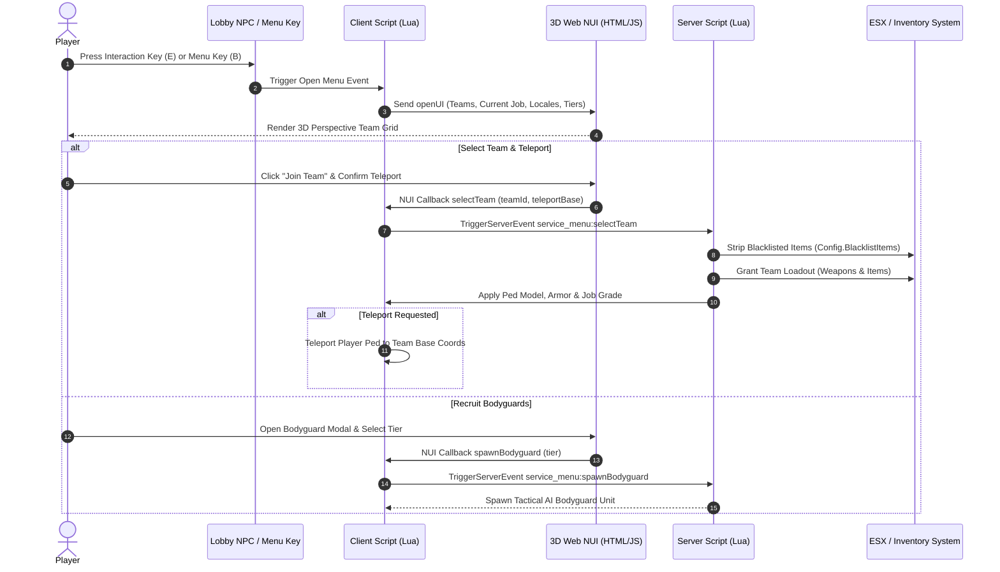

<div align="center">

# 🎖️ Tactical Service Menu & Faction Manager (`service_menu`)


<br/>

### 🌐 Select Language / Selecciona Idioma

[**🇺🇸 Read in English**](README.md) &nbsp;•&nbsp; [**🇪🇸 Leer en Español**](README.es.md) &nbsp;•&nbsp; [**⬅️ Back to Utilities Suite**](../README.md)

---

</div>

## 📌 Overview

**`service_menu`** is an advanced, high-performance FiveM resource designed for tactical roleplay servers, faction wars, and military/police operations. It provides an immersive **3D Web NUI Interface** where players can select teams/factions, view assigned tactical loadouts, request AI bodyguard escorts, teleport to team headquarters, and return to civilian status.

The system features an automatic **Blacklist Inventory Cleaner** that strips restricted gear upon faction changes to preserve server economy and prevent weapon duplication exploits.

---

## 🎨 3D Web NUI Experience

Built following modern 3D Web Experience design principles (`/3d-web-experience`), the NUI interface features:

* **Interactive 3D Perspective Card Tilt:** Team cards dynamically rotate along X and Y axes responding to mouse movement with depth perspective (`perspective(1000px)`).
* **Glassmorphic Depth & Glow:** Multi-layered CSS backdrop blur (`blur(16px)`), dynamic color glows based on faction themes, and smooth 60 FPS CSS transitions.
* **Tactical Layout:** Displays real-time item preview grids, team descriptions, base locations, and custom unit badges.
* **Responsive Modal Dialogs:** Confirmation modals for base teleportation and AI bodyguard recruitment options.

---

## 🏗️ Architecture & Event Flow



---

## ✨ Key Features

1. **Multi-Faction / Team Selector Hub:**
   * Customizable teams in `config.lua` (e.g., Yomas, Pochas, Cartel, Police, Army, Civilian).
   * Unique team colors, custom badge text, base coordinates, and custom ped models.
2. **Blacklist Inventory Cleaner:**
   * Automatically removes restricted military weapons, special ammunition, and armor when swapping factions or returning to Civilian mode.
   * Prevents gear leaks and unauthorized hoarding.
3. **Automatic Loadout & Armor Provisioning:**
   * Grants weapons, ammunition, medkits, and body armor immediately upon joining a team.
4. **Base Teleportation System:**
   * Prompt allowing players to instantly deploy to their faction's base or stay at their current location.
5. **AI Bodyguard & Escort Integration:**
   * Direct integration with bodyguard recruitment tiers. Players on duty can deploy tactical AI escorts to defend them in gunfights.
6. **Lobby NPC & Radar Blips:**
   * Spawns animated lobby NPCs with interaction prompts, 3D text floating headers, and short-range minimap blips.
7. **Admin Permission Dashboard (`Config.Admins`):**
   * Configurable license, Discord, Steam, or FiveM ID admin whitelist for administrative actions.

---

## ⚙️ Configuration Reference (`config.lua`)

```lua
Config = {}

-- Framework Settings
Config.UseESX = true
Config.ESXExport = 'esx:getSharedObject'

-- Menu Key Bind (29 = B Key)
Config.MenuKey = 29

-- Lobby NPC Location & Appearance
Config.MainNPC = {
    model = 's_m_y_swat_01',
    coords = vec4(-1038.5, -2739.8, 20.1, 330.0),
    scenario = 'WORLD_HUMAN_COP_IDLES',
    blip = {
        enabled = true,
        sprite = 487,
        color = 3,
        scale = 0.8,
        text = 'Team Selection Hub'
    }
}

-- Blacklist Items: Stripped when changing teams or reverting to Civilian
Config.BlacklistItems = {
    'WEAPON_CARBINERIFLE',
    'WEAPON_ASSAULTRIFLE',
    'WEAPON_COMBATPISTOL',
    'WEAPON_SMG',
    'armor',
    'medikit'
}

-- Available Teams Setup
Config.Teams = {
    {
        id = 'yomas',
        name = 'Yomas Tactical Unit',
        job = 'yomas',
        description = 'Special Operations Tactical Force.',
        spawnCoords = vec4(1392.2, 1141.6, 114.3, 90.0),
        color = '#3b82f6',
        colorGlow = 'rgba(59, 130, 246, 0.4)',
        image = 'img/yomas.jpg',
        badge = 'TACTICAL FORCE',
        items = {
            { name = 'WEAPON_CARBINERIFLE', count = 1, type = 'weapon' },
            { name = 'WEAPON_COMBATPISTOL', count = 1, type = 'weapon' },
            { name = 'armor', count = 2, type = 'item' }
        }
    }
}
```

---

## 🎮 Controls & Commands

| Key / Command | Target | Function |
| :--- | :--- | :--- |
| `B` or `/service` | All Players | Toggles the 3D Service Menu / Team Selector UI. |
| `E` | Nearby NPC | Interacts with the Lobby NPC to open the selection screen. |
| `/dismiss` | Active Duty Players | Dismisses all active hired bodyguards and escort units. |
| `ESC` | UI Viewers | Closes the 3D NUI menu and releases cursor focus. |

---

## 🛠️ Installation

1. Copy or clone the resource folder into your FiveM server's `resources/[local]` directory:
   ```bash
   cd resources/[local]
   ```
2. Ensure the folder is named `service_menu`.
3. Add the resource start command in your `server.cfg`:
   ```cfg
   ensure service_menu
   ```
4. Restart your server or run `refresh` and `start service_menu` in the server console.

---

## ⚡ Performance Benchmarks

* **Idle CPU Usage:** `0.00 ms`
* **Active UI / Interaction:** `0.01 ms`
* **Network Overhead:** Optimized state triggers; entity cleanup prevents pool saturation.

---

## 📄 License & Author

* **Author:** [CHW](https://github.com/CHW1534)
* **License:** MIT - Free to use and customize for FiveM servers.
